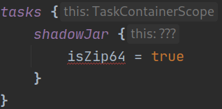
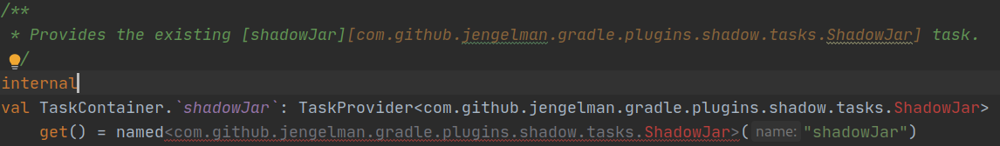
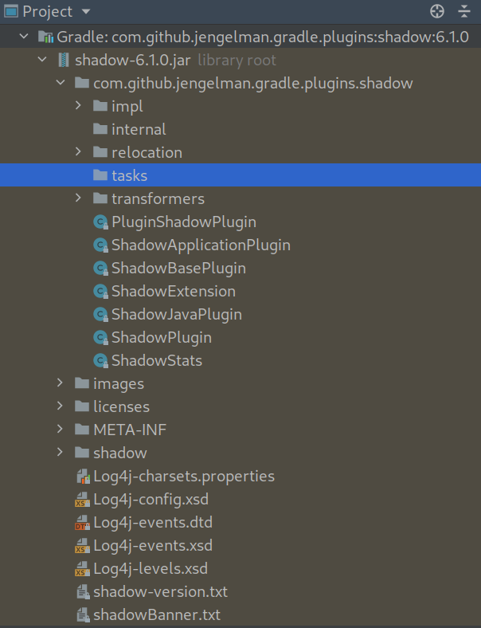

Sample project to illustrate problems with Shadow plugin v6.1.0.

Steps to reproduce:
1) Clone project.
2) Open in Intellij IDEA.
3) Open `buildSrc/build.gradle.kts`, make sure version 6.1.0 is used.
4) Sync project with Gradle files.
5) Open `buildSrc/src/main/kotlin/app-convention.gradle.kts`. Wait for IDE hints to show up.
6) Find `shadowJar` fragment, confirm that type hints are broken (`???` shows up instead of a proper type).

Repeat the same steps, but for version 6.0.0 at step 3. Type hint at step 6 appears correctly, as `ShadowJar`.

